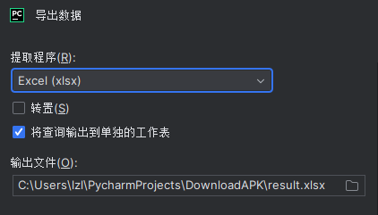

# Download-the-APK-automatically
Crawl the download links of each APK from the APKPure website and write a program to download it for the preparation of the automated test app

## 自动化下载apk -- 进组做的第一个需求

## quick start
下载本项目
```
git clone https://github.com/lzl-hello/Download-the-APK-automatically.git
```
安装所需的库（有多余，偷懒了没新建环境）
```
pip install requirements.txt
```
运行ScrapyAPK
```
scrapy crawl zhuzhou -o result.csv
```


然后在pycharm中导出为excel，不然还要额外处理乱码：


运行DownloadAPK
```
python .\main.py result.xlsx 
```
下载后的apk会保存在工具apk目录下，因为是先抓取的工具页面的apk，后面抓取不同类别的apk新建个目录，改一下存储位置即可


